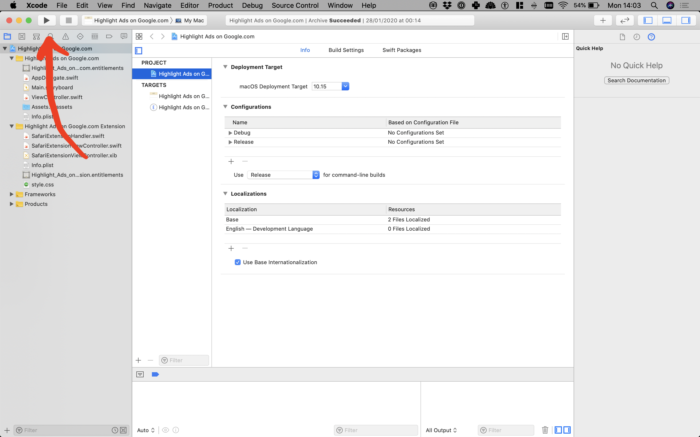

# open-source-highlight-ads-on-google
Source code for the Safari App Extension 'Highlight Ads on Google.com': https://apps.apple.com/gb/app/highlight-ads-on-google-com/id1496633107?mt=12

## You will need
- a mac with the Safari browser
- Apple's IDE [XCode](https://developer.apple.com/xcode/)

## How to use
- download or clone this repository
- open **Highlight Ads on Google.com.xcodeproj**
- click the 'play' button in the top left to build and run the app:

- click the blue 'Click here to go to Safari > Preferences... > Extensions' button in the app

- in the Safari extension preferences pane that opens up, make sure the box next to the 'Highlight Ads on ...' extension is ticked

